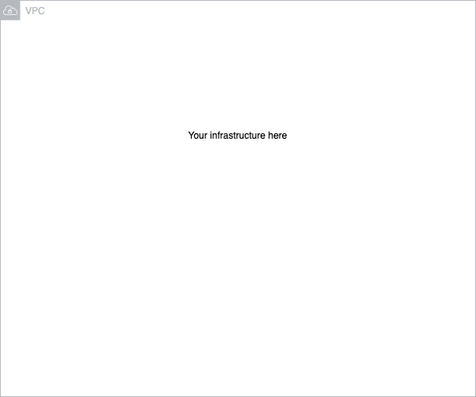

[](https://github.com/marketplace/actions/super-linter)


## mepa-ovipro-template

Description

**Add here description of API domain**
example:
_Realty API provides infrastructure, data and implementation for all Realty API's microservices._
---

<br/>

### List of OviPRO AWS repositories

| Name                                                                    | Description                                    |
| ----------------------------------------------------------------------- | ---------------------------------------------- |
| **OviPRO template repository**   | Template for quick starting a new repository                            |
| [OviPRO account wide infrastructure](https://github.com/almamedia/mepa-ovipro-common)| Shared account wide resources for OviPRO AWS infrastructure |
| [OviPRO shared infrastructure (environment)](https://github.com/almamedia/mepa-ovipro-common-environment)| Shared environment specific resources for OviPRO AWS infrastructure |
| [OviPRO shared infrastructure (account)](https://github.com/almamedia/mepa-ovipro-common-account)| Shared account specific resources for OviPRO AWS infrastructure |
| [OviPRO core backend](https://github.com/almamedia/mepa-ovipro-core-backend)       | Core backend                          |

<br/><br/>

| [Infrastructure](#aws-infrastructure) | [Otsikko1](#running) | [Otsikko2](#tests) | [Important notes](#important) |
| :-------------------------------: | :-----------------: | :-------------: | :---------------------------: |

---

<br/><br/>

## AWS infrastructure



<br/><br/>

## Authorize requests
All requests has to be authorized. Authentication is provided by Alma Yritystunnus or AWS Cognito. Both generates JWT that are validated by Authentication Lambda. This lambda will return _OrganisationPermissinTree_ object, that will contain information such _is user allowed to perform action in orgranisation Y_.
This auhtorization will be done using _has-permission_ functions such as `checkForPermission`. Here is a sample:
```javascript
import { checkForPermission } from '/auth/has-permission/index';
import { APIGatewayEvent } from 'aws-lambda';
import jsonBodyParser from '@middy/http-json-body-parser';
import middy from '@middy/core';

async function processRequest(event: APIGatewayEvent): Promise<unknown> {
    ...
    const isAuthorized: boolean = checkForPermission({level: OrganizationUnitLevel.CUSTOMER, organizationId: 12345, permission: PermissionType.PRO_VIEWER}, event.requestContext, false);
    ...
}

export const handler = middy(processRequest).use(jsonBodyParser());

```

## Quality and Assurance
Q&A gate should be checked on every push. We use Sonarqube (sonarcloud) for this. In order to check it, project key has to be created into Sonarcloud (requested from `Antti Koivisto`). All relavent information is to be updated to `sonar-project.properties` file.
