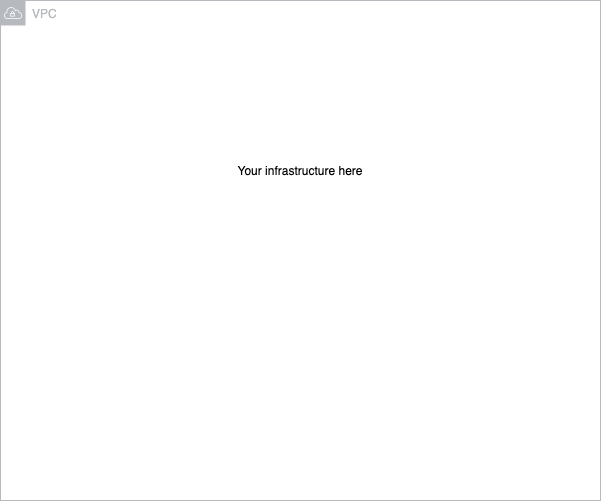

## [Your project name]

OviPRO AWS infrastructure as code

-   🚨 100% written in TypeScript
-   🎯 Created with [AWS Cloud Development Kit](https://github.com/aws/aws-cdk)
-   ✅ Testing with Jest & CDK assert
-   ℹ️ CI/CD in [Github Actions](https://docs.github.com/en/actions)

[Description of your repository here]

 

## Motivation

AWS CDK offers AWS-maintained high-level abstractions (called Constructs or Patterns) for AWS resources, which lead to better safety and developer experience. This also means **we** have a lot less code to maintain (for example compared to pure CloudFormation-based projects).

## Build status

TBD

## Code style

-   Eslint, Typescript and Prettier
-   If you are using vsc, it is highly recommended to use our shared settings `.vscode/settings.json`.
    By default VSC autoimports them, but if you have a manual setup consider copying them to your workspace settings.

## Infrastructure

## Tech/framework used

<b>Built with</b>

-   [Typescript](https://www.typescriptlang.org/)
-   [AWS CDK](https://github.com/aws/aws-cdk)
-   [Jest](https://jestjs.io/)
-   [NCC](https://github.com/vercel/ncc)
-   [Github Actions](https://github.com/features/actions)

We are also using [Ari Palo's](https://github.com/aripalo) useful custom CDK helper libraries:

-   [Tag and Name](https://github.com/almamedia/alma-cdk-jsii-tag-and-name)
-   [Regions](https://github.com/almamedia/alma-cdk-jsii-regions)
-   [Accounts and Environments](https://github.com/almamedia/alma-cdk-jsii-accounts-and-environments)
-   [OpenAPI](https://github.com/almamedia/alma-cdk-jsii-open-api)

## Features

This template repository includes helpers-constructs, which import all the shared resources defined in [OviPRO infrastructure](https://github.com/almamedia/mepa-ovipro-infra).
Use them when needed.

## Installation

Make sure your node version is >14

-   Consider using [n](https://github.com/tj/n) for version management

1. CDK

Follow [AWS-docs](https://docs.aws.amazon.com/cdk/latest/guide/getting_started.html) for latest guide. Includes installing CDK and generating AWS-profiles.

2. Node dependencies

Currently Alma private packages are served from AWS Codeartifact. Access keys can be found on 1PW:s _Mepa Alma Codeartifact_-vault, which can then be used to download the artifacts. Temporary solution, packages will be served from github packages in the future.

-   run `` export CODEARTIFACT_AUTH_TOKEN=`aws codeartifact get-authorization-token --domain almamedia --domain-owner 277005280161 --query authorizationToken --output text --profile YOUR_CREDENTIAL_OR_PROFILE_HERE`  ``
-   run `npm i`

3. NCC

Lambda has no native support for Typescript yet, so we currently use Vercel's NCC to compile Typescript lambdas. NCC must be installed globally.

-   run `npm i -g @vercel/ncc`

## Running

### CDK stacks

Automatic compilation

-   `npm run watch`

Temporary credentials / MFA

-   [Assumed credentials-package](https://github.com/almamedia/alma-cdk-jsii-assumed-credentials-provider) is in use to cache MFA!
-   If you wish to opt-out, just use normal `--profile`-flag in your commands instead

### Lambdas

TBD, current quick guide

1. Develop your lambda, refer to `functions/sample` for sample
2. Add the new lambda to package.json
3. Run `npm run build:your_lambda`
4. Your lambda is now generated to `dist/functions/{your_lambda}`
5. Deploy stack

## Development

TBD, current model

1. Develop your new features or changes in a Jira-ticket named branch (eg. JIRA-NNNN)
2. If you want, you can deploy preview-versions of your resources using a preview-type environment, named as `preview/JIRANNNN` (more info about environments in [Accounts & environments](https://github.com/almamedia/alma-cdk-jsii-accounts-and-environments)) **Note:** Dont use dashes (-) in branch name!. If you have dependencies on resources in other repositories, you need to deploy them to same environment (Jira-ticket named branch and environment).
3. You also have the "lazy" option of deploying your changes and resources to development-environment by using development branch. Remember, that this environment is **not** stable and can be used by anyone.
4. When your changes in a PR are ready and reviewed, merge them to _main_-branch. Changes in main-branch are automatically deployed to staging-environment. **Never** deploy anything to staging-environment manually, it is not meant to be used as a development environment
5. Changes in _staging_-branch will be deployed to preprod-account nightly, if tests are showing green. **Never** deploy anything manually to preprod!
6. Manual deployments to production-account

## API Reference

Not yet implemented

## Tests

TBD

### Unit testing

Keep unit tests in the same folder as their source file.

### Snapshot testing

Keep snapshots always updated, and remember to commit their changes

### E2E testing

E2e-tests should be placed in e2e-folder.

## Important

--

**NEVER** make changes to CDK-deployed resources in web console (or anywhere else than CDK). The manually modified resources might become out-of-sync with CDK, and you can not deploy changes to your stacks anymore.
If you make this mistake, you need to manually delete the stacks before deploying them again.

--

Feel like Jest tests are passing while they shouldn't? Run `npm run clean` and build again. Sometimes Typescript compiling gets stuck (especially when renaming stuff)
